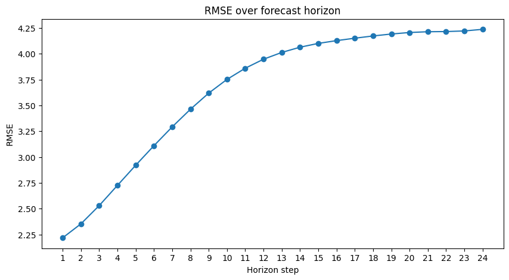

# Deep Learning Weather Forecasting (Jena Climate)

End-to-end deep learning pipeline for **multistep temperature forecasting** using the **Jena Climate dataset**.

The model predicts the next **24 hours of temperature** using the previous **72 hours of meteorological observations**.

Model architecture: **CNN + BiLSTM**

---

## Project Overview

This project implements a complete machine learning workflow for **time series forecasting**.

Main components:

- Data preprocessing pipeline
- Feature scaling and sliding window generation
- CNN + BiLSTM forecasting model
- Training and evaluation pipeline
- Visualization of results
- Reproducible project structure

The repository is designed to be **modular, reproducible, and extensible**, making it easy to experiment with new models or preprocessing strategies.

---

## Dataset

The project uses the **Jena Climate dataset**, which contains weather measurements recorded at the **Max Planck Institute for Biogeochemistry in Jena, Germany**.

The dataset includes **10-minute resolution observations from 2009 to 2016**.

For this project we use a subset of meteorological variables:

| Feature     | Description                   |
|-------------|-------------------------------|
| `p_(mbar)`  | Atmospheric pressure          |
| `T_(degC)`  | Temperature (target variable) |
| `rh_(%)`    | Relative humidity             |
| `sh_(g/kg)` | Specific humidity             |
| `wv_(m/s)`  | Wind velocity                 |
| `wd_(deg)`  | Wind direction                |

The dataset is **automatically downloaded** when running the pipeline.

---

## Forecasting Setup

- **Target variable:** Temperature (`T_(degC)`)
- **Input window:** 72 hours
- **Forecast horizon:** 24 hours
- **Model:** CNN + BiLSTM

The model receives a window of past meteorological observations and predicts the **next 24 temperature values simultaneously**.

---

## Model Architecture

The forecasting model combines convolutional and recurrent layers:


- CNN → feature extraction from time windows  
- BiLSTM → temporal modeling of sequential patterns   
- Dense layers → final multistep prediction


Input:
- Window size: 72 hours
- Features: 6 meteorological variables

Output:
- 24-step temperature forecast

---

## Project Structure

```text
deep-learning-weather-forecasting/

├── main.py
├── scripts/
│   └── generate_figures.py
│
├── configs/             # (future extension)
│
├── data/
│   ├── raw/
│   └── processed/
│
├── notebooks/
│   └── 01_Jena_Climate_Forecasting_CNN_BiLSTM.ipynb
│
├── outputs/
│   ├── models/
│   ├── metrics/
│   ├── predictions/
│   └── figures/
│
├── src/
│   ├── data/
│   ├── preprocessing/
│   ├── models/
│   ├── visualizations/
│   └── utils.py
│
├── tests/             # (future extension)
│
├── requirements.txt
├── LICENSE
└── README.md
```

---

## Installation

Clone the repository and install dependencies:

```bash
git clone https://github.com/cgaton0/deep-learning-weather-forecasting.git
cd deep-learning-weather-forecasting
pip install -r requirements.txt
```

Dependencies include:

- numpy
- pandas
- scikit-learn
- tensorflow
- keras
- matplotlib
- pyarrow
- joblib

---

## Usage

### Train and evaluate the model

```bash
python main.py
```
This will:

1. Download the dataset (if not present)
2. Run the preprocessing pipeline
3. Train the CNN + BiLSTM model
4. Evaluate performance on the test set
5. Save artifacts to the `outputs/` directory

---

### Generate evaluation figures

```bash
python scripts/generate_figures.py --show
```

This script generates visualizations including:

- Training curves
- Prediction examples
- Random forecast samples
- Error metrics over the forecast horizon

---

## Example Results

Model performance on the test set:

```text
Test Loss (scaled): 0.2074
Test RMSE (scaled): 0.4555
RMSE (°C): 3.9375
MAE (°C): 3.0440
Correlation: 0.9059
R²: 0.7447
```

Example metric evolution across the forecast horizon:



The model performs well for short-term forecasts and shows the expected gradual degradation for longer horizons.

---

## Notebook Walkthrough

A detailed walkthrough of the pipeline is available in the notebook:

```text
notebooks/01_Jena_Climate_Forecasting_CNN_BiLSTM.ipynb
```
The notebook demonstrates:

- Dataset exploration
- Preprocessing pipeline
- Model training
- Evaluation and visualizations

---

## Future Improvements

Potential extensions to the project include:

- Configuration system for experiment management
- Baseline models (e.g., persistence forecasting)
- Unit tests for the preprocessing pipeline
- Hyperparameter search
- Alternative architectures:
  - Temporal Convolutional Networks (TCN)
  - Transformer-based models
  - Attention mechanisms

---

## License

This project is licensed under the **MIT License**.

See the `LICENSE` file for details.
